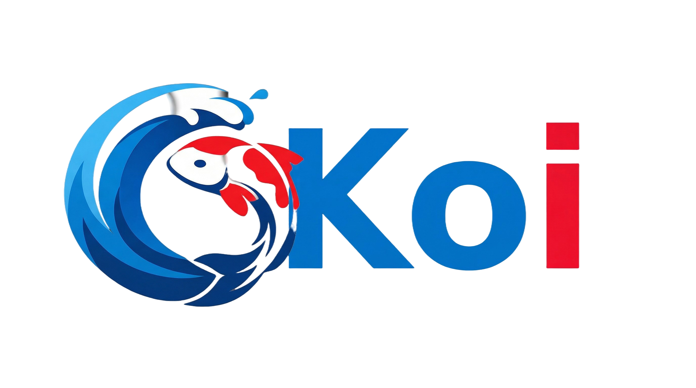

<div align="center">
  
</div>

# Koi - Agent-first language. Calm orchestration. 🌊

[](LICENSE)
[](https://github.com/koi-language/Koi)
[](vscode-koi-extension/)
[](LINGUIST.md)

Koi is a multi-agent orchestration language with role-based routing.

## Quick Install

```bash
curl -fsSL https://raw.githubusercontent.com/koi-language/Koi/main/install.sh | bash
```

> **🚀 New to Koi?** Check out the [Quick Start Guide](QUICKSTART.md) for a 2-minute setup!
>
> **📚 Complete Documentation**: See the [doc/](doc/) directory for comprehensive guides

## Architecture

### Key Concepts

- **Agent**: Autonomous worker with a role, executes playbooks
- **Playbook**: Natural language instructions that define agent behavior
- **Role**: Abstract capabilities (can delegate, can execute, can read, ...)
- **Team**: Agent composition that enables collaboration
- **Skills**: Reusable capability with internal logic and agents

## Installation

**Quick install (recommended):**

```bash
curl -fsSL https://raw.githubusercontent.com/koi-language/Koi/main/install.sh | bash
```

This will install KOI to `~/.koi` and add the `koi` command to your PATH.

**For manual installation, development setup, and troubleshooting:** See the [Installation Guide](doc/00-installation.md).

## Usage

### With Global Installation

If you installed Koi globally, use the `koi` command directly:

```bash
koi compile examples/simple.koi
koi run examples/simple.koi
koi init my-project
```

### With Local Development

If working on Koi itself, use `node src/cli/koi.js`:

```bash
node src/cli/koi.js compile examples/simple.koi
node src/cli/koi.js run examples/simple.koi
```

Or use npm scripts:

```bash
npm run compile examples/simple.koi
npm run run examples/simple.koi
```

### Debugging

To run with Node.js inspector:

```bash
npm run dev examples/simple.koi
# or
node --inspect src/cli/koi.js run examples/simple.koi
```

Then open Chrome DevTools at `chrome://inspect`.

## Syntax

### Define Roles

```koi
role Worker   { can execute, can propose }
role Reviewer { can critique, can approve }
role Lead     { can delegate, can decide }
```

### Define Agents

Agents describe their behavior in natural language using **playbooks**:

```koi
Agent Analyzer : Worker {
  uses Skill DataAnalysis
  llm default = { provider: "openai", model: "gpt-4o-mini" }

  on analyze(args: Json) {
    playbook """
    Analyze the data: ${args.data}

    Look for patterns, trends, and anomalies.
    Provide actionable insights.
    """
  }
}
```

**For technical operations** (like fetching data), use procedural code:
```koi
Agent DataFetcher : Worker {
  on fetch(args: Json) {
    const response = await fetch(args.url)
    const data = await response.json()
    return { data: data }
  }
}
```

### Define Teams

```koi
Team Development {
  analyzer   = Analyzer
  calculator = Calculator
}
```

### Role-based Routing

```koi
Agent Orchestrator : Lead {
  uses Team Development
  llm default = { provider: "openai", model: "gpt-4o-mini" }

  on start(args: Json) {
    playbook """
    Task: ${args.task}

    Work with the development team to complete this task.
    Coordinate with team members based on their capabilities.
    """
  }
}
```

Agents automatically route to appropriate team members - no hardcoded names needed!

### MCP (Model Context Protocol) Support

Reference remote agents and services using MCP addresses:

```koi
Team HybridTeam {
  local = LocalAgent
  remote = mcp://agent.local/processor
  skill = mcp://skills.local/sentiment
}

Agent Orchestrator : Worker {
  uses Team HybridTeam

  on start(args: Json) {
    // Executes on local or remote agent transparently
    const result =
      await send peers.event("process").role(Worker).any()(args)
    return result
  }
}
```

#### Expose agents as MCP servers

Use `expose mcp` to make an agent's handlers available as MCP tools for external clients (Claude Code, Cursor, etc.):

```koi
agent CodeReviewer : Reviewer {
  expose mcp

  on review(args: Json) {
    affordance "Review code for quality and bugs"
    playbook "Review this code: ${args.code}"
  }

  private on internal_step(args: Json) {
    // Not exposed — private handlers are excluded
    playbook "Internal logic"
  }
}
```

Serve it with `koi serve agent.koi` and add to any `.mcp.json`:

```json
{ "mcpServers": { "reviewer": { "command": "koi", "args": ["serve", "agent.koi"] } } }
```

See [MCP Integration Guide](doc/10-mcp-integration.md) for complete documentation.

### Define Skills

```koi
Skill SentimentAnalysis {
  affordance """
  Analyzes text sentiment and returns positive/neutral/negative.
  """

  Agent Analyst : Worker {
    llm default = { provider: "openai", model: "gpt-4o-mini" }

    on analyze(args: Json) {
      playbook """
      Text: ${args.text}

      Analyze the sentiment of this text:
      - Determine overall tone (positive, neutral, negative)
      - Rate emotional intensity (0.0 to 1.0)
      - Identify key emotional indicators
      """
    }
  }

  Team Internal {
    analyst = Analyst
  }

  export async function run(input: any): Promise<any> {
    const result = await send Internal.event("analyze").role(Worker).any()(input)
    return result
  }
}
```

### Using Skills in Agents

Agents can use skills for technical operations while keeping behavior in natural language:

```koi
import "./skills/email-reader.koi"  // Skill for IMAP email operations

Agent EmailAssistant : Worker {
  uses Skill EmailReader
  llm default = { provider: "openai", model: "gpt-4o-mini" }

  on processInbox(args: Json) {
    playbook """
    Lee los últimos mensajes de correo y contesta aquellos que
    vengan de proveedores automáticamente.

    Para cada email de proveedor:
    - Analiza el contenido y el remitente
    - Genera una respuesta profesional apropiada
    - Marca como procesado

    Ignora emails personales o de clientes.
    """
  }
}
```

**Skills** = Technical operations (IMAP, databases, APIs)
**Playbooks** = Natural language behavior

### Execute

```koi
run EmailAssistant.processInbox({ email: "user@company.com", since: "2024-01-01" })
```

## Examples

### 🆕 Task Chaining (Recommended Start)

Shows how outputs automatically chain into inputs between tasks:

```bash
koi run examples/task-chaining-demo.koi
```

Example: "Translate to French and count words"
- Action 1: Translate → `{ translated: "bonjour monde" }`
- Action 2: Count words on `${previousResult.translated}` → `{ wordCount: 2 }`

See [Task Chaining Guide](doc/08-task-chaining.md) for details.

### Simple

Minimal example showing agent communication:

```bash
koi run examples/simple.koi
```

### Counter

Stateful agent with counter operations:

```bash
koi run examples/counter.koi
```

### Calculator

Basic calculator with multiple operations:

```bash
koi run examples/calculator.koi
```

### Pipeline

Multi-stage data processing pipeline:

```bash
koi run examples/pipeline.koi
```

### Sentiment Analysis

Sentiment analysis skill with 2 internal agents:

```bash
koi run examples/sentiment.koi
```

### MCP Integration

Example showing MCP (Model Context Protocol) address support:

```bash
koi run examples/mcp-example.koi
```

See [MCP Integration Guide](doc/10-mcp-integration.md) and [Planning System Guide](doc/09-planning.md) for more details on advanced features.

## Source Maps

Koi generates source maps automatically. Runtime errors show the location in the original `.koi` source, not the generated JavaScript.

## Project Structure

```
.
├── package.json
├── README.md
├── src/
│   ├── grammar/
│   │   └── koi.pegjs              # PEG grammar
│   ├── compiler/
│   │   ├── parser.js              # Generated parser (auto)
│   │   └── transpiler.js          # Transpiler to JS + source maps
│   ├── runtime/
│   │   ├── agent.js               # Agent runtime
│   │   ├── team.js                # Team runtime
│   │   ├── skill.js               # Skill runtime
│   │   ├── role.js                # Role runtime
│   │   ├── runtime.js             # Main runtime
│   │   └── index.js               # Exports
│   └── cli/
│       └── koi.js                 # Main CLI
└── examples/
    ├── simple.koi                 # Simple example
    ├── counter.koi                # Counter example
    ├── calculator.koi             # Calculator example
    ├── pipeline.koi               # Pipeline example
    └── sentiment.koi              # Sentiment analysis
```

## Documentation

Comprehensive documentation is available in the [doc/](doc/) directory:

- **[Installation Guide](doc/00-installation.md)** - Complete installation instructions, manual setup, and troubleshooting
- **[Getting Started](doc/00-getting-started.md)** - Your first agent and basic workflow
- **[Core Concepts](doc/01-core-concepts.md)** - Understanding Roles, Agents, Teams, Skills
- **[Syntax Basics](doc/02-syntax-basics.md)** - Variables, types, control flow
- **[Agents Guide](doc/03-agents.md)** - Creating and using agents
- **[Roles & Teams](doc/04-roles-and-teams.md)** - Multi-agent systems
- **[Skills](doc/05-skills.md)** - Reusable capabilities
- **[LLM Integration](doc/06-llm-integration.md)** - Using real LLMs with playbooks
- **[Automatic Routing](doc/07-routing.md)** - Intelligent agent selection
- **[Task Chaining](doc/08-task-chaining.md)** - Output-to-input chaining
- **[Planning System](doc/09-planning.md)** - Automatic task decomposition
- **[MCP Protocol](doc/10-mcp-integration.md)** - Consume and expose MCP servers
- **[TypeScript Imports](doc/11-typescript-imports.md)** - Using npm packages
- **[Testing](doc/12-testing.md)** - Unit testing with Jest
- **[Caching](doc/13-caching.md)** - Persistent LLM response caching
- **[Examples](doc/14-examples.md)** - Complete working examples
- **[Advanced Topics](doc/15-advanced.md)** - Debugging, performance, production
- **[Registry](doc/16-registry.md)** - Shared data store for agent coordination

## Contributing

Contributions are welcome! Here are some ways you can help:

- 🐛 Report bugs and issues
- 💡 Suggest new features or improvements
- 📝 Improve documentation
- 🎨 Help with GitHub Linguist PR (see [LINGUIST.md](LINGUIST.md))
- 🔧 Submit pull requests

See [CONTRIBUTING.md](CONTRIBUTING.md) for guidelines.

## Resources

- **Documentation**: [doc/](doc/) - Comprehensive guides
- **Quick Start**: [QUICKSTART.md](QUICKSTART.md) - 2-minute setup
- **Editor Setup**: [doc/00-editor-setup.md](doc/00-editor-setup.md) - VS Code & Cursor
- **Examples**: [examples/](examples/) - Working code samples
- **AI Assistant Guide**: [CLAUDE.md](CLAUDE.md) - Architecture and patterns
- **Syntax Highlighting**: [LINGUIST.md](LINGUIST.md) - GitHub support status

## Community

- **Issues**: [github.com/koi-language/Koi/issues](https://github.com/koi-language/Koi/issues)
- **Discussions**: [github.com/koi-language/Koi/discussions](https://github.com/koi-language/Koi/discussions)

## License

MIT
